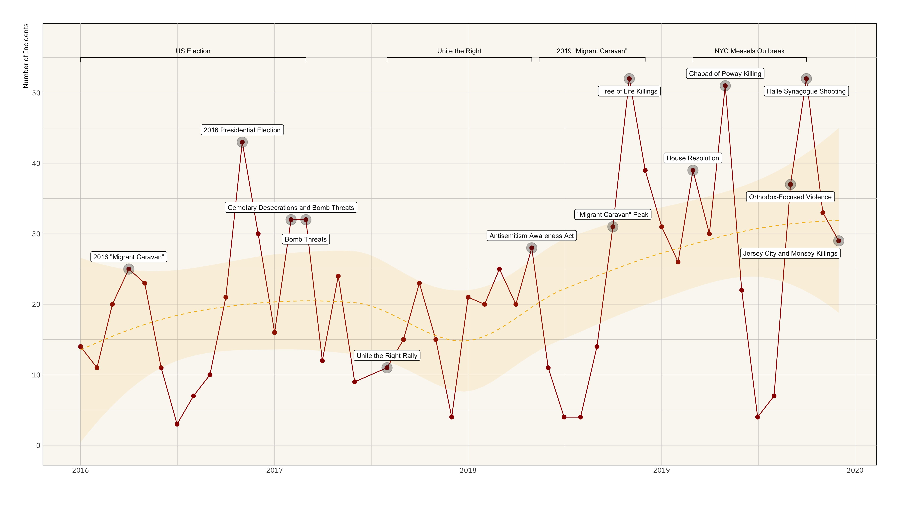

## Investigating School Hate in Context

Antisemitic incidents in schools are a widespread and pervasive phenomenon. The <abbr title="Anti-Defamation League">ADL</abbr> has reported a three-fold increase in school-based antisemitic incidences between 2015 and 2018, and a nearly two-fold increase in violent and non-violent incidences of antisemitism in general nationwide.



This project utilizes data from the [ADL <abbr title="Hate, Extremism, Antisemitism, and Terrorism">H.E.A.T.</abbr> Map](https://www.adl.org/education-and-resources/resource-knowledge-base/adl-heat-map) between 2016 and 2019 to identify incidents of antisemitism that specifically took place in schools. These incidents in schools are influenced by demographic, historical, social, and political factors. This project brings this data together to construct a community typology at the national level. This typology will provide insight into the ways that school-based incidents of hate are enacted and reported in context.

Developing a community typology will allow providers to better target specific demographic, historical, and political attributes of the communities in which these incidents occur through curriculum and learning experiences.

This research is funded by an [IUPUI Office of the Vice Chancellor of Research Research](https://www.iupui.edu/research/index.html) [Start-Up Funds Grant](https://research.iu.edu/funding-proposals/funding/opportunities/research-support-funds-grant/index.html) and an [IUPUI Institute of Integrative AI](https://iai.iupui.edu/) [Collaboration Grant](https://iai.iupui.edu/research/funded-proposals/antisemitism/).
